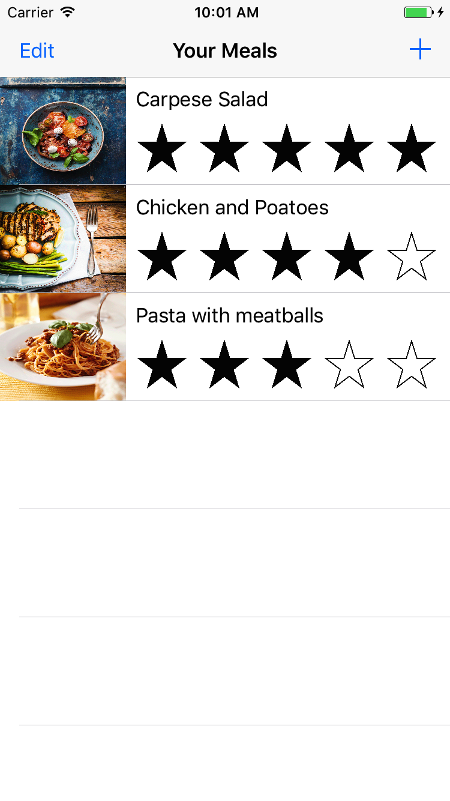
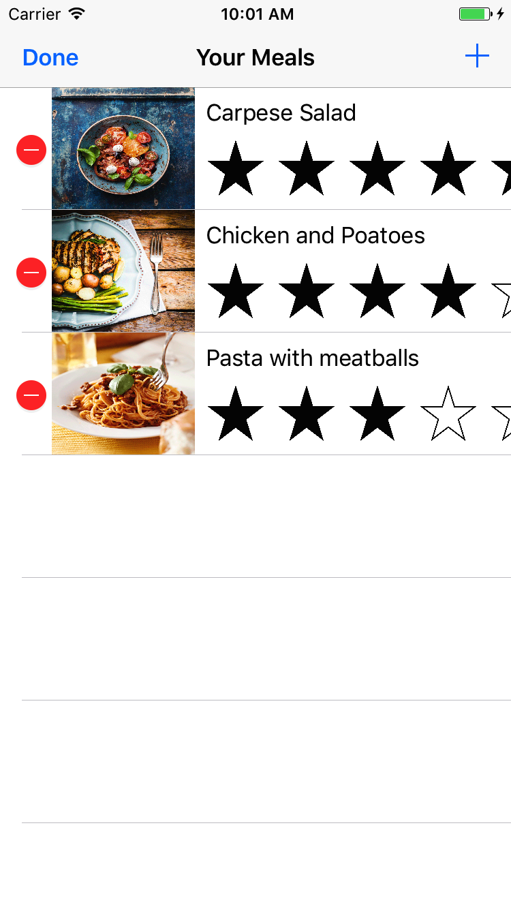
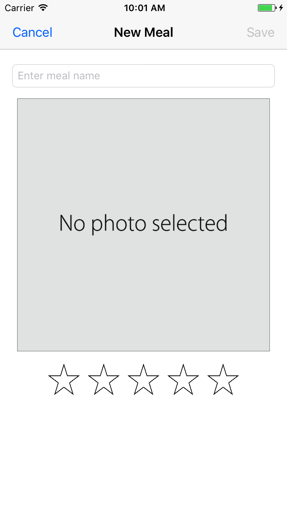
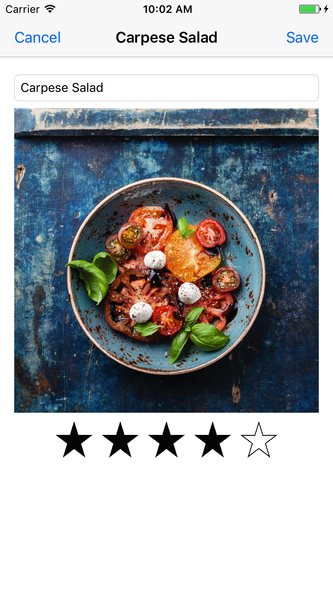

Demo iOS app I made following apple's official tutorial to learn key concepts of iOS development.

### Features:
- View meals in a table view using custom table cell
- Add a meal
- Delete a meal
- Edit a meal
- Save and load meals using NSCoding protocol

    
